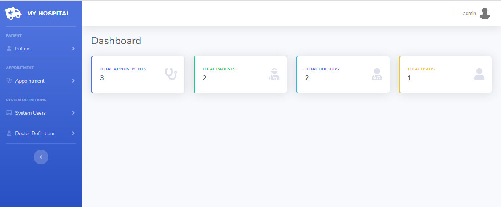
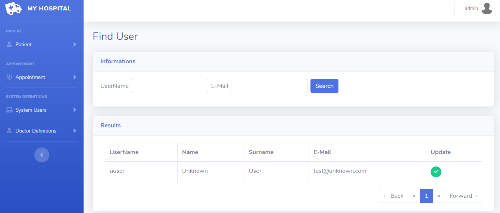

# Doctor appointment system - Demo Spring-MVC project

Doctor Appointment System is a Spring MVC application developed for demo purpose. Run **"data.sql"** script after initialize Doctor appointment system database.

## Default credentials:
* **username**: admin
* **password**: admin

## Technology stack:
* Spring Boot
* Spring MVC
* Spring Data JPA
* Spring Security
* MySQL
* ModelMapper
* Thymeleaf
* Bootstrap 4

## Previews of Project

